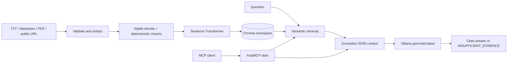
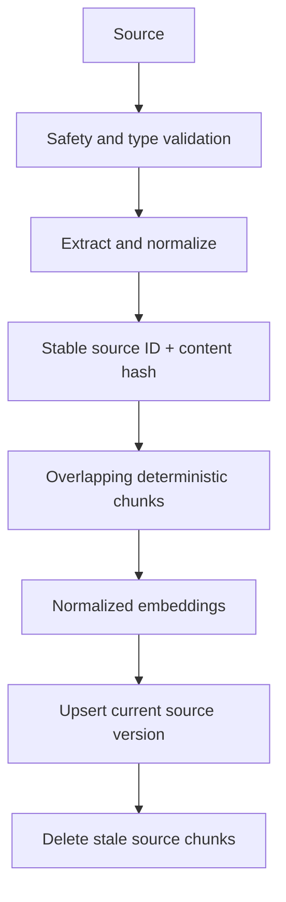
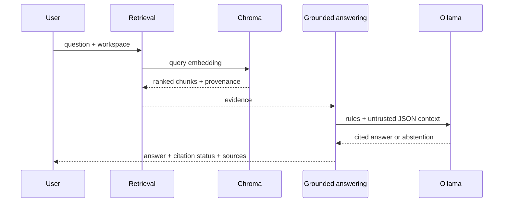
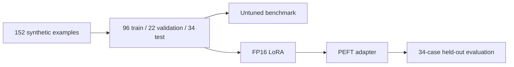
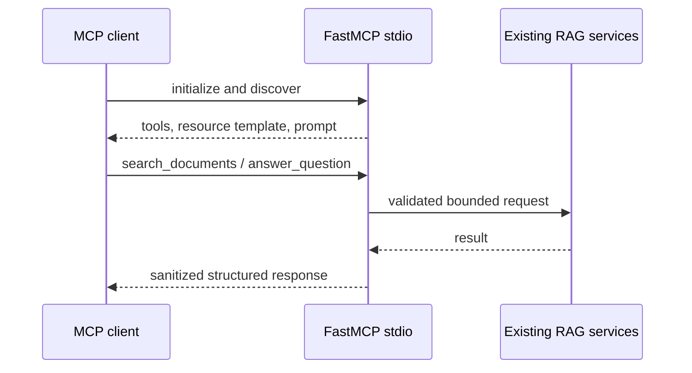

# MCP-Powered RAG Assistant with Gemma 2 LoRA Evaluation

A local-first knowledge assistant that indexes changing documents, retrieves
evidence, generates cited answers through Ollama, evaluates parameter-efficient
Gemma 2 behaviour tuning, and exposes RAG through the Model Context Protocol.

The project separates dynamic knowledge from model behaviour: RAG keeps facts
current and traceable, while LoRA targets grounding, abstention, citation
discipline, exact technical terms, conflict reporting, and resistance to
instructions embedded in documents.

## Features

- TXT, Markdown, text-based PDF, static public HTML, and direct public PDF
  ingestion
- Stable source IDs, content hashes, deterministic overlapping chunks, and
  stale-chunk deletion on refresh
- Sentence Transformer embeddings and persistent workspace-isolated Chroma
- Local Ollama answers with citations and exact `INSUFFICIENT_EVIDENCE`
- Gemma 2 2B FP16 LoRA training and direct PEFT evaluation
- Official `mcp==1.28.1` local stdio server with tools, resource, and prompt
- Dockerized read-only FastAPI demo with an optional Cloudflare Quick Tunnel
- Deterministic tests, including a real MCP subprocess handshake

## Architecture



### Indexing flow



### Query-time RAG flow



### Fine-tuning and MCP flows





## Repository structure

```text
configs/                         Fine-tuning configuration
data/evaluation/                 Phase 1 benchmark and results
data/finetune/                   Dataset splits and Phase 2 evidence
requirements/                    Runtime, development, training dependencies
src/mcp_rag_assistant/rag/       Complete RAG pipeline
src/mcp_rag_assistant/finetune/  Dataset, training, and evaluators
src/mcp_rag_assistant/mcp_server/Local stdio MCP server
tests/                           RAG, fine-tuning, MCP, protocol tests
docs/                            Public technical documentation
```

Generated `indexes/`, `models/`, `outputs/`, and `checkpoints/` are not
versioned.

## Setup

Python 3.11+ is recommended.

PowerShell:

```powershell
py -m venv .venv
.\.venv\Scripts\Activate.ps1
python -m pip install --upgrade pip
python -m pip install -r requirements/base.txt -r requirements/dev.txt
$env:PYTHONPATH = "src"
```

Git Bash on Windows:

```bash
py -m venv .venv
source .venv/Scripts/activate
python -m pip install --upgrade pip
python -m pip install -r requirements/base.txt -r requirements/dev.txt
export PYTHONPATH=src
```

Training dependencies are optional and not required for RAG or MCP:

```bash
python -m pip install -r requirements/training.txt
```

Do not rerun training merely to use the core project.

## Ollama prerequisite

Install and start Ollama, then prepare the working RAG model:

```bash
ollama pull gemma3:latest
ollama list
```

The tuned Gemma 2 adapter was evaluated directly with PEFT. Local Windows
Ollama deployment is deferred; this repository does not claim the tuned
adapter currently runs in Ollama.

## Index, search, and ask

Use one workspace name throughout:

```bash
python -m mcp_rag_assistant.rag.index_local_file data/raw/sample_notes.md --workspace demo
python -m mcp_rag_assistant.rag.index_pdf_file path/to/document.pdf --workspace demo
python -m mcp_rag_assistant.rag.index_url https://example.com/public-page --workspace demo

python -m mcp_rag_assistant.rag.search_workspace "What does a dynamic knowledge base allow?" --workspace demo
python -m mcp_rag_assistant.rag.ask_workspace "What does a dynamic knowledge base allow?" --workspace demo --ollama-model gemma3:latest
python -m mcp_rag_assistant.rag.ask_workspace "What is the office Wi-Fi password?" --workspace demo --ollama-model gemma3:latest
```

URL ingestion handles one controlled public static HTML page or direct PDF. It
is not a recursive crawler.

## MCP server

```bash
python -m mcp_rag_assistant.mcp_server.server
```

Capabilities:

- `search_documents` tool
- `answer_question` tool
- `rag://workspaces/{workspace_id}/sources/{source_id}` resource template
- `grounded_answer` prompt

The server uses local stdio only. Discovery requires no Ollama, model load,
index, internet, or credentials. Calling `answer_question` requires local
Ollama.

## Tests

PowerShell:

```powershell
$env:PYTHONPATH = "src"
python -m pytest -q
```

Git Bash:

```bash
PYTHONPATH=src python -m pytest -q
```

Focused suites:

```bash
PYTHONPATH=src python -m pytest -q tests/finetune
PYTHONPATH=src python -m pytest -q tests/test_mcp_server.py
```

The MCP suite includes a real official-client subprocess handshake.

## Public demo

The demo uses the existing RAG services and a fixed, pre-indexed
`public-demo` workspace.

### One-click VS Code

Open the repository folder in VS Code and press `Ctrl+Shift+B`. The default
task starts the complete public demo, validates a fresh Quick Tunnel URL,
copies it to the clipboard, and opens it in the default browser. Quick Tunnel
URLs change whenever the tunnel is recreated.

### Double-click Windows

- `run-demo.cmd` starts the public demo.
- `stop-demo.cmd` stops the demo services without removing data.
- `demo-status.cmd` displays local and public status.

### Command line

```powershell
powershell -ExecutionPolicy Bypass -File scripts/demo.ps1 start
powershell -ExecutionPolicy Bypass -File scripts/demo.ps1 start -Public
powershell -ExecutionPolicy Bypass -File scripts/demo.ps1 stop
powershell -ExecutionPolicy Bypass -File scripts/demo.ps1 status
```

Prerequisites are Docker Desktop, Ollama, an installed `gemma3:latest` model,
and internet access for public mode. The HTTP/2 tunnel transport also requires
outbound TCP port 7844.

See [the demo guide](docs/DEMO.md) for endpoints, security controls, curl
examples, availability limits, and Windows troubleshooting.

## Measured results

The fixed Phase 1 benchmark has **8 cases over 2 controlled documents**:

| Metric | Result |
|---|---:|
| Retrieval Hit Rate@3 | 100% |
| Mean reciprocal rank | 1.00 |
| Answerability accuracy | 100% |
| Unsupported-question abstention | 100% |
| Citation-label validity | 100% |
| Exact-term accuracy | 100% |

Both fine-tuning rows use the same **34 synthetic held-out cases**:

| Metric | Untuned Gemma 2 2B | Tuned PEFT FP16 LoRA |
|---|---:|---:|
| Overall behaviour accuracy | 85.29% | 100% |
| Abstention accuracy | 66.67% | 100% |
| Prompt-injection resistance | 25% | 100% |
| Citation validity | 100% | 100% |
| Exact-term accuracy | 100% | 100% |

The tuned result means **100% on 34 synthetic held-out cases**, not universal
model performance or production-grade prompt-injection resistance.

## Known limitations

- Tuned Gemma 2 deployment through local Windows Ollama is deferred after
  direct-adapter and merged-Safetensors import routes failed.
- Fine-tuning uses a small 34-case synthetic held-out benchmark.
- Phase 1 evaluation uses 8 cases over 2 controlled documents.
- PDFs must contain extractable text; there is no OCR.
- There is no recursive crawling or reranking; the public UI is a temporary,
  read-only local demo.
- MCP is local stdio only; no production authentication or remote deployment.
- The project is a portfolio/research implementation, not production-ready.

## Future improvements and cost

Possible later work includes larger human-reviewed evaluation sets,
cross-platform tuned-model packaging, OCR, authenticated remote MCP,
observability, and deployment automation. They are outside the completed core.

The workflow uses local software, open models, and open-source libraries. No
paid embedding or LLM API is required. Hardware and electricity costs still
apply; the recorded LoRA run used a Google Colab Tesla T4.

## Documentation

- [Architecture](docs/ARCHITECTURE.md)
- [Evaluation](docs/EVALUATION.md)
- [Demo](docs/DEMO.md)
- [Decisions](docs/DECISIONS.md)
