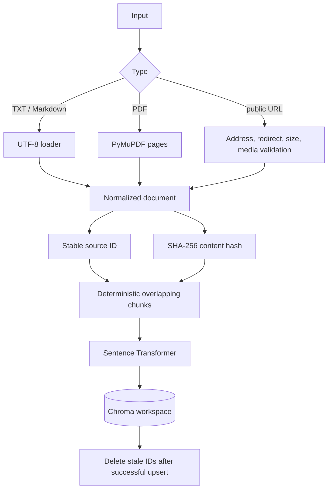
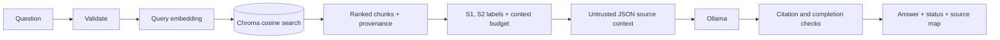
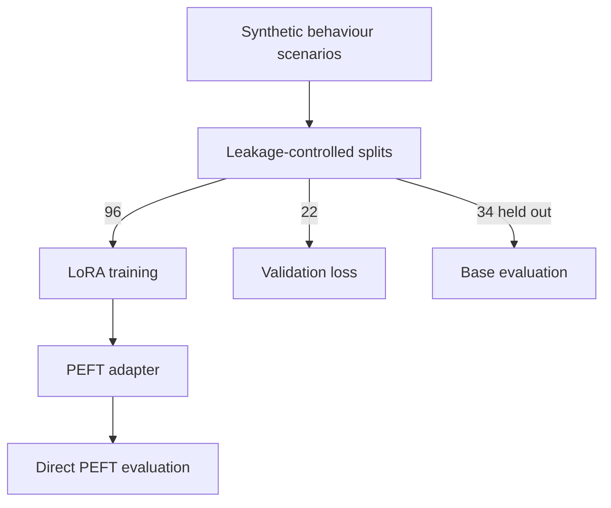
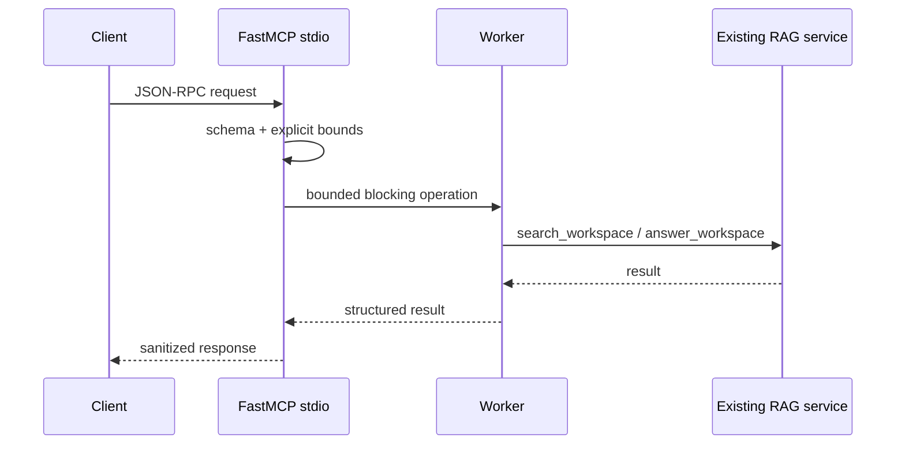

# Architecture

## Component boundaries

| Responsibility | Owning modules |
|---|---|
| Source models and local validation | `rag/ingestion/models.py`, `local_file.py` |
| PDF page extraction | `rag/ingestion/pdf_file.py` |
| Controlled URL fetching | `rag/ingestion/public_url.py` |
| Chunk models and algorithms | `rag/chunking/` |
| Embeddings | `rag/embeddings/sentence_transformer.py` |
| Storage and source lifecycle | `rag/storage/chroma_store.py` |
| Retrieval | `rag/retrieval/service.py` |
| Grounding and citations | `rag/answering/service.py` |
| Ollama protocol | `rag/generation/ollama_client.py` |
| CLI composition | `rag/index_*.py`, `search_workspace.py`, `ask_workspace.py` |
| Training and evaluation | `finetune/` |
| MCP adaptation | `mcp_server/server.py` |

MCP calls the existing workspace search and answer composition; it does not
implement a second RAG pipeline.

## Indexing and source lifecycle

`source_id` identifies the logical location and stays stable after an edit.
`content_hash` identifies the normalized content version. This lets refresh
replace old chunks without pretending the updated source is unrelated.

Chunk IDs deterministically include source identity, content version, chunking
configuration, and position. Unchanged re-indexing is idempotent; changed
content produces new IDs. The store upserts the complete current set before
deleting stale records.

## Retrieval and answering

Retrieval creates semantic results and human-readable source citations.
Answering labels sources, budgets source text, serializes document contents as
untrusted JSON, and checks returned citation labels. With no usable source,
generation is skipped and `INSUFFICIENT_EVIDENCE` is deterministic.

Provenance begins in ingestion metadata, survives chunking and Chroma, and is
formatted during retrieval/answering. Valid PDF metadata adds page ranges.

## Fine-tuning pipeline

`build_dataset.py` owns data. `train_lora.py` renders the chat template,
tokenizes without duplicate special tokens, trains FP16 LoRA, and records
metadata. `evaluate_ollama.py` owns shared scoring without importing Chroma.
`evaluate_peft_adapter.py` performs direct adapter evaluation.

Training loss, validation loss, and held-out behavioural accuracy are distinct
measurements on distinct splits.

## MCP pipeline

Heavy RAG dependencies are imported lazily so discovery needs no model or
index. Blocking embedding, Chroma, and Ollama calls run in worker threads with
wall-clock timeouts.

## Security controls

- Workspace IDs, queries, source IDs, and `top_k` are validated and bounded.
- URL ingestion rejects credentials, non-public destinations, unsafe
  redirects, unsupported ports/media, and oversized downloads.
- Indexed text is treated as untrusted data in the grounding prompt.
- Citations are checked against labels actually supplied.
- MCP errors omit internal paths, secrets, and stack traces; public metadata
  omits local source URIs.
- Stdio stdout is reserved for protocol data.
- Secrets and generated model/index artifacts are excluded from Git.

The project does not provide production authentication, remote MCP transport,
or arbitrary local-file sandboxing.
